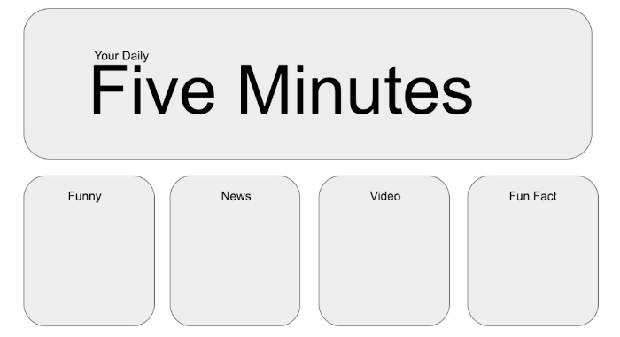
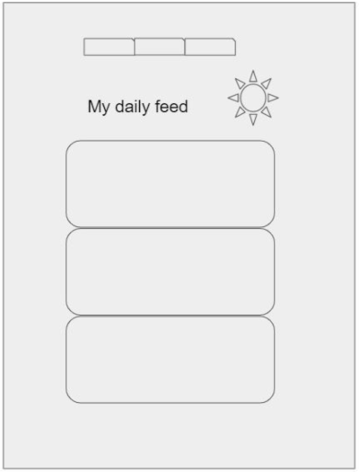

## Your-Daily-5-Minutes

---

A responsive app for an individual who seeks 5 minute entertainment by a video, a song, fun facts or news headlines. Your daily 5 minutes is a collaborative project of four team members.

### Branding(Tagline)

---

### User Story

---

As a busy person who has some free time available now, I would like to be able to quickly find an entertainment option amongst media presented on a site when I take a break from my current work.

### Acceptance Criteria

---

- WHEN I first visit the site 
  THEN I am presented with a choice of videos, songs, fun facts or news 
  THEN I am presented with a list of interests that will filter my results.

- WHEN I click on the preferences buttons 
  THEN I can change my media type 
  THEN I can change my interests

- WHEN I select my selection of results 
  THEN I am presented with card previews of my entertainment results

- WHEN I view the youtube card 
  THEN I see a thumbnail of the top recommended video (5 min max) matching my preferences
- WHEN I click on Video result 
  THEN I am able to view a video (5 min max)

- WHEN I view the news card 
  THEN I see the preview of the top news headline matching my preferences

- WHEN I click on the news card 
  THEN I am able to view a list news article headlines

- WHEN I click on a headline 
  THEN I am able to read the news article for that headline

- WHEN I view the music card 
  THEN I am presented with the ability to preview the first song recommended song in a web playback

### Initial wireframes/ideas

---

### Plan refinement

---

In the course of the app development, we have decided to remove the fun fact feature, as its value in substantiating our app is much lower than news, music and video.

### Media access instructions

---

As a frontend app without the backend support, to protect API keys and or auth tokens from exposing to the public, we utilise local storage.

- Music:  
- News:  
- Video:  
  To access video, the user must have a valid youtube api key. To apply for youtube API, the user is required to have an account on the Google cloud platform and a named project associated with Youtube Data API v3. API key can be generated under credentials.

### Technologies used

---

- Third party APIs
- Javacript, jQuery and CSS framework
